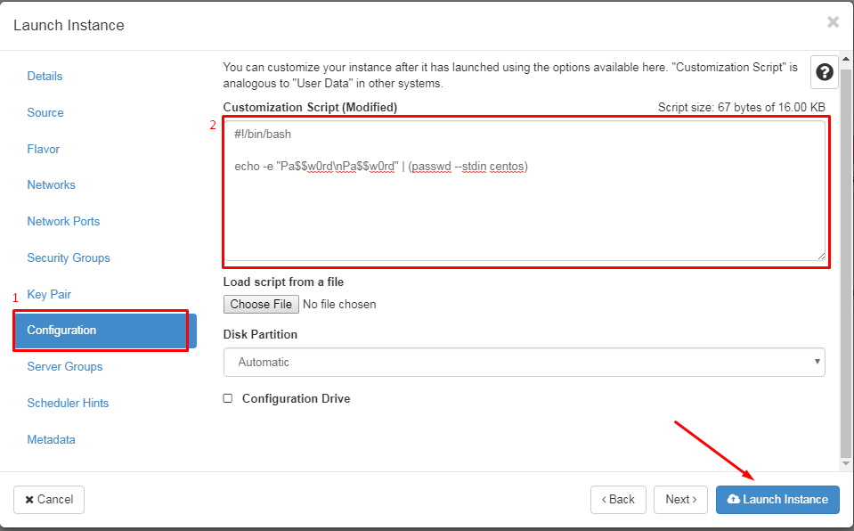
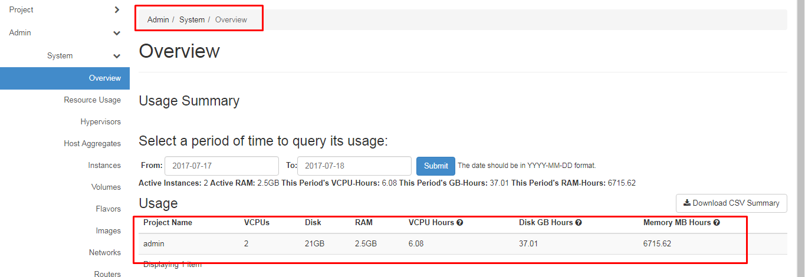
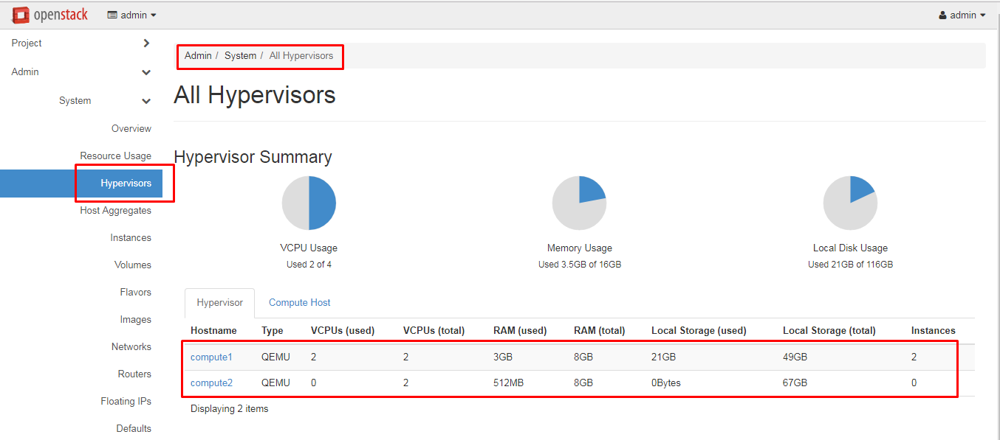

## Ghi chép Dashboard của OpenStack

### Sử dụng Script để reset password user

*Chú ý*: Chỉ những image được build và sử dụng Cloud-init mới có thể sử dụng.

Sau khi điền các thông số cho VM, chúng ta chọn phần *Configuration* để cấu hình:



Nội dung trong ô:

```sh
#!/bin/bash

echo -e "Pa$$w0rd\nPa$$w0rd" | (passwd --stdin centos)
```

- *Giải thích*:
	- `centos`: USER có sẵn trong IMAGE
	- `Pa$$w0rd`: Password muốn đặt cho USER
### Dashboard

- Kiểm soát, thống kê tài nguyên đang sử dụng: 

```
Admin/System/Overviews
```



- Tài nguyên đã sử dụng ở các node COM:

```
Admin/System/All Hypervisors
```


