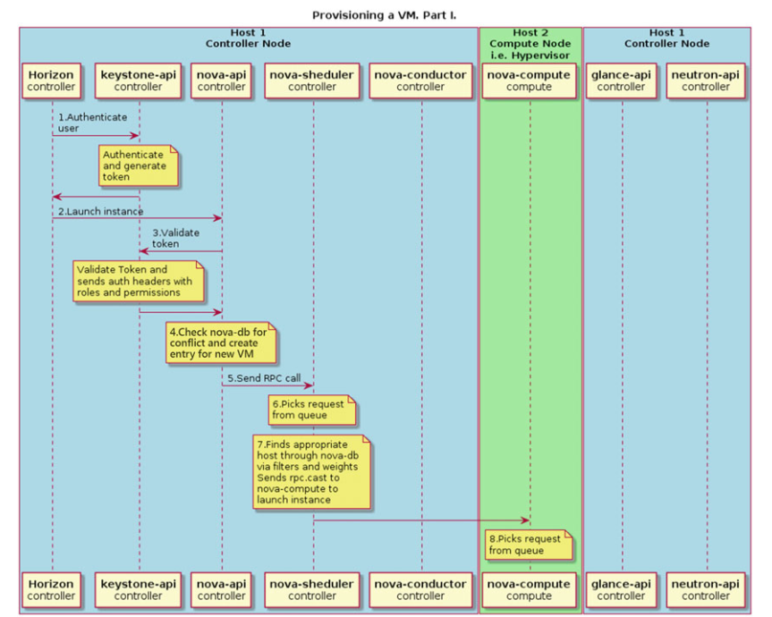
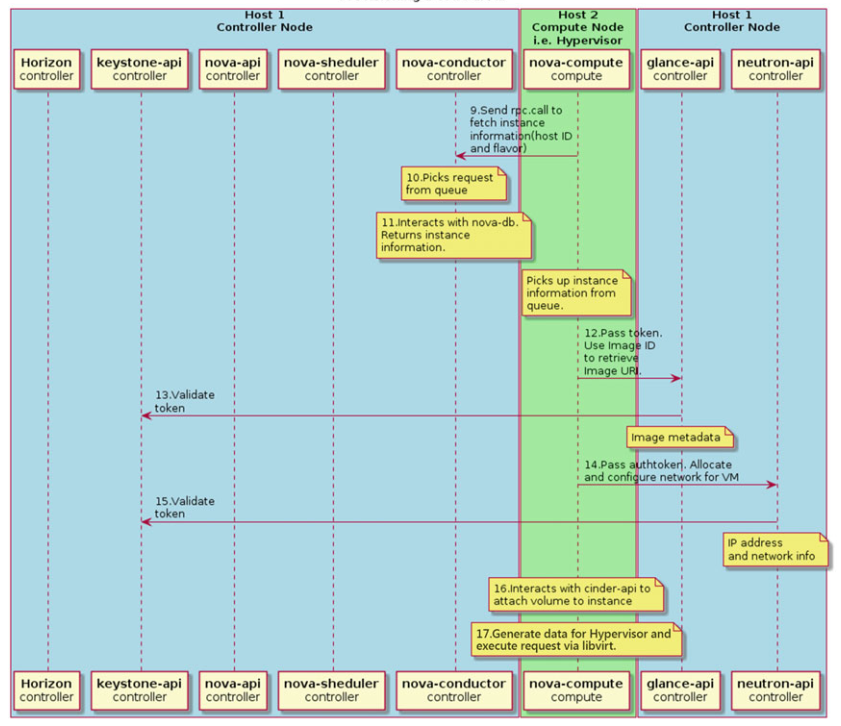

### Kiến trúc của Nova

- nova-api: This service receives REST API calls from other services and clients and responds to them.
- nova-scheduler: This is Nova’s scheduling service. It takes requests for starting instances from the queue and selects a compute node for running a virtual machine on it. The selection of Hypervisor is based on its weight and filters. Filters can include an amount of memory, a requested availability zone, a set of group hosts, among others. The rules apply each time the instance is started or when migrating to another Hypervisor.
- nova-conductor: This is the proxy service between the database and the novacompute services. It helps with horizontal scalability.
- nova-compute: This is the main part of an IaaS system. This daemon usually runs only on compute nodes. Its role is to rule Hypervisor through the Hypervisor’s specific API. It is designed to manage pools of computer resources and can work with widely available virtualization technologies.
- nova-nonvncproxy and nova-consoleauth: These are two services for providing access to the instances console through remote access VNC protocol. The former acts as the VNC-proxy and the latter is responsible for authorization.

### Quy trình tạo một máy ảo:

Hình 1: 

Hình 2: 

- 1. The client (in this particular example the client is Horizon web client, but it can be nova CLI command) asks keystone-api for authentication and generates the access token.
- 2. If authentication succeeds, the client sends a request for a running instance to nova-api. It is similar to the nova boot command.
- 3. Nova service validates the token and receives headers with roles and permissions from keystone-api.
- 4. Nova checks the database for conflicts with existing names of objects and creates a new entry for this instance in its database.
- 5. Nova-api sends the RPC for a scheduling instance to nova-scheduler service.
- 6. Nova-scheduler service picks up the request from the message queue.
- 7. Nova-scheduler service finds an appropriate compute host through the database via filters and weights. Then scheduler sends the RPC call to nova-compute service to launch the virtual machine.
- 8. Nova-compute service picks up the request from the message queue.
- 9. Nova-compute service asks nova-conductor to fetch information about the instance, for example: host ID, flavor, etc.
- 10. Nova-conductor service picks up the request from the message queue.
- 11. Nova-conductor service gets information about an instance from the database.
- 12. Nova-compute takes the instance information from the queue. At this moment the compute host knows what image will be used to start the instance. Novacompute asks the glance-api service for a particular image URL.
- 13. Glance-api validates the token and returns the metadata of the image including the URL.
- 14. Nova-compute service passes a token to neutron-api and asks it to configure the network for the instance.
- 15. Neutron validates the token and configures the network.
- 16. Nova-compute interacts with cinder-api to attach the volume to the instance.
- 17. Nova-compute generates data for Hypervisor and executes the request via libvirt